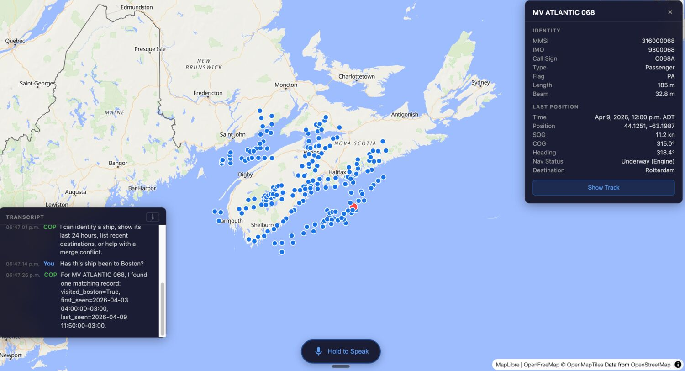

# Maritime COP Prototype

Prototype maritime common operating picture with a MapLibre frontend, FastAPI backend, synthetic AIS seed data, local Whisper transcription, and a deterministic assistant loop for map-aware vessel queries.



The current release voice is Piper `en_US-ryan-high`, stored under `models/` and served through the backend `/voice/speak` endpoint.

## Stack

- Frontend: React + Vite + MapLibre GL JS
- Backend: FastAPI
- Storage: Parquet + DuckDB
- Voice transcription: `faster-whisper`
- Voice synthesis: `piper`
- Local package tools: `pnpm`, `uv`

## Project Layout

```text
backend/   FastAPI app, data access, tools, voice, agent
frontend/  React app, map UI, voice UI, conflict UI
data/      Seed generator and generated Parquet partitions
AGENTS.md  Implementation plan and phase guide
```

## Prerequisites

- Python 3.11+
- Node.js 20+
- `pnpm`
- `uv`

## Setup

### Backend

```bash
uv venv .venv
uv pip install --python ".venv/bin/python" -r backend/requirements.txt
```

If Piper is installed in the shared workspace environment instead of the project venv, set `PIPER_COMMAND` in `.env` to that executable path.

### Frontend

```bash
cd frontend
pnpm install
cd ..
```

## Generate Seed Data

```bash
".venv/bin/python" data/generate_seed.py
```

This writes synthetic AIS data to `data/seed/` with at least one duplicate timestamp per MMSI inside the last 24 hours so the merge-conflict demo remains testable.

## Run

### Backend

```bash
".venv/bin/python" -m uvicorn backend.main:app --reload --port 8000
```

### Frontend

```bash
cd frontend
pnpm dev
```

The frontend defaults to `http://127.0.0.1:8000`. To point at a different backend, set `VITE_API_BASE_URL`.

### Piper Voice

The checked-in default voice is Ryan:

```env
PIPER_MODEL_PATH=models/en_US-ryan-high.onnx
PIPER_CONFIG_PATH=models/en_US-ryan-high.onnx.json
```

If the backend cannot resolve `piper` from its runtime environment, also set:

```env
PIPER_COMMAND=/absolute/path/to/piper
```

## Demo Flow

1. Open `http://localhost:5173`.
2. Click a ship marker.
3. Confirm the right-side `ShipPanel` shows vessel identity and recent destinations.
4. Confirm the selected ship's 24h track is visible.
5. Use the voice button or send a transcript through the UI flow for:
   - `What is this vessel?`
   - `Show last 24 hours track`
   - `Show last 5 destinations`
   - `Merge these two tracks`
6. Resolve the conflict panel with `Keep Most Recent`.
7. Confirm the transcript rail updates and the selected track refreshes.
8. Confirm agent replies play through the Ryan Piper voice.

## API Summary

### Core Reads

- `GET /ships`
- `GET /ships?bbox=minLon,minLat,maxLon,maxLat`
- `GET /ships/{mmsi}`
- `GET /ships/{mmsi}/history?hours=24`
- `GET /ships/{mmsi}/destinations?limit=5`

### Voice + Agent

- `POST /voice/transcribe`
- `POST /voice/speak`
- `POST /agent/query`

### Overlay CRUD

- `POST /positions`
- `PUT /positions/{id}`
- `DELETE /positions/{id}`
- `POST /positions/merge`

### Extension Stubs

- `POST /ingest/ais`
- `GET /alerts`

## Notes

- Seed parquet is immutable. CRUD and merge behavior use an in-memory overlay path.
- The current assistant behind `/agent/query` is deterministic and local. The contract is designed so an LLM-backed agent can replace it later.
- Viewport ship refreshes happen on map `moveend`.

## Build

```bash
cd frontend
pnpm build
```
